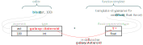
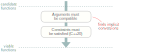

# How C++ Resolves A Function Call

Ref: [How C++ Resolves A Function Call](https://preshing.com/20210315/how-cpp-resolves-a-function-call/)

这是编译器如何为一个给定*函数调用表达式*匹配正确的函数的过程：


这些步骤包含在C++标准中，每一家的C++编译器都必须得遵守这些标准。并且，对于函数调用表达式的评估的整个过程都在编译期。

其中的一些东西都可能符合我们的直觉，但是某一些在第一眼看到还是比较让人难以理解。这其中涉及到了几个C++常谈的东西，比如ADL(Argument-dependent lookup)和SFINAE啥的。

## Name Lookup

从名称查找阶段开始，举个例子。如下一段代码，表达式`blast(ast, 100)`函数调用最终会调用哪一个函数？

```c++
namespace galaxy {
    struct Asteroid {
        float radius = 12;
    };
    // candidates 1
    void blast(Asteroid* ast, float force);
}

struct Target {
    galaxy::Asteroid* ast;
    Target(galaxy::Asteroid* ast) : ast{ast} {}
    operator galaxy::Asteroid*() const { return ast; }
};

// candidates 2
bool blast(Target target);
template <typename T> void blast(T* obj, float force);

void play(galaxy::Asteroid* ast) {
    blast(ast, 100);
}
```

第一个过程是**name lookup**. 在这一步，编译器会向上查找所有具有相同标识(identity)的函数和函数模版.


如流程图所示，主要有三种名称查找，每一种都有对应的规则。

- **Member name lookup** 发生在`.`或者`->`标识之后，比如在`foo->bar`。这种lookup通常用于定位类的成员。
- **Qualified name lookup** 发生在当名称中携带了域标识符`::`，比如`std::sort`。这种名称查找是显示的。只会在`::`左边部分所标识的范围内查找右边的部分。
- **Unqualified name lookup** 不属于上面范围。当编译器看到一个未限定的名称，比如`blast`。会根据上下文在不同的范围里查找名称。详细的[规则](https://en.cppreference.com/w/cpp/language/unqualified_lookup)在这。

在我们的例子中的是一个未限定名称查找。 编译器会找到很多符合条件的声明，我们称为**candidates**。在上面的例子中我们有三个候选:


上面圈出的第一个候选代码值得格外关注，因为它展示了 C++ 的一个容易被忽视的特性：参数依赖查找(argument-dependent lookup)，简称为 ADL。下面是一个快速总结，以防你也遇到同样的问题。通常情况下，你不会想到这个函数会被调用，因为它是在 galaxy 命名空间内声明的，而调用来自 galaxy 命名空间之外。代码中也没有 `using namespace galaxy` 指令让这个函数可见。那么，为什么这个函数是候选函数呢？

其原因是，当在函数调用中使用未限定的名称时（该名称不指向类成员），ADL 就会启动，并且名称查找会变得更加贪婪。具体来说，除了常规的查找方式外，编译器还会在**参数类型的名称空间**中查找候选函数，这就是 "依赖参数查找 "的由来。


具体的 [ADL规则](https://en.cppreference.com/w/cpp/language/adl) 比我在这里描述的要细致得多，但关键是 ADL 只适用于非限定名称。对于在单个作用域中查找的限定名称，ADL 没有作用。ADL 在重载 `+` 和 `==` 等内置运算符时也起作用，这让你在编写数学库时可以利用它。

有趣的是，在某些情况下，成员名称查找可以找到未限定名称查找找不到的候选者。有关详情，请参阅 Eli Bendersky 发表的[这篇文章](https://eli.thegreenplace.net/2012/02/06/dependent-name-lookup-for-c-templates)。

## Special Handling of Function Templates

通过名称查找找到的候选函数中，有些是函数，有些是函数模板。函数模板只有一个问题：我们无法调用函数模版。只能够调用函数。因此，在名称查找之后，编译器会浏览候选列表，并尝试将每个函数模板转化为合适的函数。


在我们的示例中，第三个候选模板实际上就是函数模板：


这个函数模板只有一个模板参数 `T`，因此它需要一个模板参数。调用者 `blast(ast, 100)` 没有指定任何模板参数，因此为了将此函数模板转化为函数，编译器必须推导出 `T` 的类型。在这一步中，编译器会将调用者传递的函数参数类型（如下图左侧）与函数模板期望的函数参数类型（如下图右侧）进行比较。如果右侧引用了任何未指定的模板参数（如 T），编译器会尝试使用左侧的信息对其进行推导。



在本例中，编译器将 `T` 演绎为 `galaxy::Asteroid`，因为这样做可以使第一个函数参数 `T*` 与参数 `ast` 兼容。关于[模板参数推导的规则](https://en.cppreference.com/w/cpp/language/template_argument_deduction)是一个很大的话题，但在像本例这样的简单例子中，它们通常会达到你所期望的效果。如果模板参数推导不起作用，换句话说，如果编译器无法以一种使函数参数与调用者参数*兼容*的方式推导出模板参数，那么函数模板就会从候选列表中删除。

候选列表中的任何函数模板，只要能存活到这一步，都将进入下一步：模板参数替换。在这一步中，编译器会使用函数模板声明，并用相应的模板参数替换每个模板参数的每一次出现。在我们的例子中，模板参数 `T` 被替换为推导出的模板参数 `galaxy::Asteroid`。这一步成功后，我们终于得到了一个可以调用的真正函数的签名，而不仅仅是一个函数模板！


当然，在某些情况下模板参数替换可能会失败。假设同一个函数模板接受第三个参数，如下所示：

```c++
template <typename T> void blast(T* obj, float force, typename T::Units mass = 5000);
```

如果是这种情况，编译器就会尝试用 `galaxy::Asteroid` 替换 `T::Units` 中的 `T`。由于 `galaxy::Asteroid` 实际上并没有名为 `Units` 的成员，因此产生的类型标识 `galaxy::Asteroid::Units` 将是错误的。模板参数替换将失败。

当模板参数替换失败时，函数模板就会从候选列表中删除--在 C++ 历史上的某个时刻，人们意识到这是一个可以利用的特性！这一发现催生了一整套元编程技术，统称为 SFINAE（替换失败不是错误）。SFINAE 是一个复杂难懂的话题，我在这里只说两点。首先，它本质上是一种操纵函数调用解析过程的方法，使其选择你想要的候选结果。其次，随着时间的推移，程序员越来越多地使用现代 C++ 元编程技术（如约束和 constexpr if）来实现同样的目的，SFINAE 可能会逐渐失宠。

## Overload Resolution

重载决议

在这一阶段，名称查找过程中发现的所有函数模板都已消失，我们只剩下一组整齐的候选函数。这也被称为重载集。下面是我们示例中更新后的候选函数列表：


接下来的两个步骤通过确定哪些候选函数是可行的（换句话说，哪些可以处理函数调用）来进一步缩小此列表的范围。



也许最明显的要求就是参数类型必须兼容；也就是说，一个可行的函数应该能够接受调用者的参数。如果调用者的参数类型与函数的参数类型不完全匹配，那么*至少*可以将每个参数*隐式*地转换为相应的参数类型。让我们看看示例中的每个候选函数，看看其参数是否兼容：


- **Candidate1**

  调用者的第一个参数类型 `galaxy::Asteroid*` 完全匹配。调用者的第二个参数类型 `int` 可以隐式转换为第二个函数参数类型 `float`，因为 `int` 到 `float` 是一种[标准转换](https://learn.microsoft.com/en-us/cpp/cpp/standard-conversions?view=msvc-170)。因此，候选1 的参数是兼容的。

- **Candidate2**

  调用者的第一个参数类型 `galaxy::Asteroid*` 可以隐式转换为第一个函数参数类型 `Target`，因为 `Target` 有一个转换构造函数，可以接受 `galaxy::Asteroid*` 类型的参数。（因为 `Target` 有一个用户定义的转换函数，可以隐式转换为 `galaxy::Asteroid*` 类型）。然而，调用者传递了两个参数，而候选 2 只接受一个参数。因此，候选 2 不可行。

  

- **Candidate2**

  候选 3 的参数类型与候选 1 相同，因此也是兼容的。

就像这个过程中的其他事情一样，控制[隐式转换](https://en.cppreference.com/w/cpp/language/implicit_conversion)的规则本身就是一个完整的主题。最值得注意的规则是，通过将构造函数和转换操作符标记为*显式(explicit)*，可以避免让它们参与隐式转换。

在使用调用者的参数过滤掉不兼容的候选函数后，编译器会继续检查每个函数的约束（如果有的话）是否满足。约束是 C++20 的一项新功能。通过它，您可以使用自定义逻辑来排除候选函数（来自类模板或函数模板），而不必求助于 SFINAE。它们还能提供更好的错误信息。我们的示例没有使用约束，因此可以跳过这一步。（从技术上讲，标准规定在推导模板参数时也要提前检查约束，但我跳过了这一细节）。在这两个地方进行检查有助于确保显示最佳的错误信息）。

## TieBreakers

重裁决议的最后时刻

在这个例子中，我们只剩下两个可行的函数。其中任何一个都可以很好地处理原始函数调用：


事实上，如果上述任何一个函数是唯一可行的函数，那么它就是处理函数调用的函数。但由于存在两个函数，编译器现在必须做它在有多个可行函数时总是要做的事情：它必须确定哪一个是最佳可行函数。要成为最佳可行函数，其中一个函数必须 "战胜"(更加匹配于) 所有其他可行函数，这是由一系列规则决定的。


让我们来看看前三条决胜规则:

1. Better-matching parameters wins

    C++ 最重视调用者的参数类型与函数参数类型的匹配程度。粗略地说，C++ 更喜欢那些需要对给定参数进行较少隐式转换的函数。当两个函数都需要转换时，某些转换被认为比其他转换 "更好"。例如，`std::vector` 的 [`operator[]`](https://en.cppreference.com/w/cpp/container/vector/operator_at) 就是根据这一规则决定调用 `const` 或非 `const` 版本的。

    在我们下面的示例中，两个可行的函数具有相同的参数类型，因此没有一个比另一个更好。这是一个平局。因此，我们进入第二个赛点。

2. Non-template function wins

    如果第一名的胜负没有分出胜负，那么 C++ 会优先调用非模板函数，而不是模板函数。在我们的例子中，这就是决定胜负的规则：可行函数 1 是一个非模板函数，而可行函数 2 来自模板。因此，我们的**最佳**可行函数是来自星系命名空间的函数：

    

    值得重申的是，前面两个条件是按照我描述的方式排序的。换句话说，如果有一个可行的函数，其参数与给定参数的匹配程度比其他所有可行的函数都要好，那么*即使它是一个模板函数*，也会优先选择。

3. More specialized template wins

    在我们的例子中，我们已经找到了最佳可行函数，但如果没有找到，我们就会进入第三关。在这一决胜局中，C++ 更倾向于调用"更特化的"的模板函数。例如，请看下面两个函数模板：

    ```c++
    template <typename T> void blast(T obj, float force);
    template <typename T> void blast(T* obj, float force);
    ```

    对这两个函数模板进行模板参数推导时，第一个函数模板接受任何类型作为第一个参数，但第二个函数模板只接受指针类型。因此，可以说第二个函数模板更加专业化(more specialized)。如果这两个函数模板是我们调用 `blast(ast, 100)` 时进行名称查找的唯一结果，并且这两个结果都是可行的函数，那么当前的规则将导致第二个函数模板被选中，而不是第一个。决定哪个函数模板比另一个函数模板[更特化的规则](https://en.cppreference.com/w/cpp/language/function_template#Function_template_overloading)是另一个大课题。

    尽管第二个函数模板被认为更专业化，但重要的是要明白，它实际上并不是第一个函数模板的偏特化。恰恰相反，它们是两个完全独立的函数模板，只是碰巧同名而已。换句话说，它们是重载的。C++ 不允许对函数模板进行部分特化。

除了这里列出的几种情况外，还有[其他几种](https://en.cppreference.com/w/cpp/language/overload_resolution#Best_viable_function)打破平衡的情况。例如，如果 [<=> 操作符](https://devblogs.microsoft.com/cppblog/simplify-your-code-with-rocket-science-c20s-spaceship-operator/) 和重载*比较操作符*（如 `>`）都可行，C++ 会优先选择比较操作符。如果候选的是用户定义的转换函数，还有其他规则比我列出的规则更优先。尽管如此，我相信我所展示的三个决定因素是最重要的。

毋庸置疑，如果编译器检查了每一个条件，却没有找到一个明确的声明，那么编译就会失败。

## After the Function Call Is Resolved

旅程到此结束。编译器现在已经知道 `blast(ast, 100)` 表达式应该调用哪个函数了。不过，在许多情况下，编译器在解析函数调用后还有更多工作要做：

- 如果被调用的函数是一个类成员，编译器必须检查该成员的访问规范，以确定调用者是否可以访问该成员。
- 如果被调用的函数是模板函数，编译器会尝试实例化该模板函数，前提是其定义可见。
- 如果被调用的函数是虚拟函数，编译器会生成特殊的机器指令，以便在运行时调用正确的覆盖。

这篇文章并不包含任何新信息。它基本上是对 cppreference.com 已经描述过的算法的浓缩解释，而 [cppreference](https://en.cppreference.com/w/cpp/language) 又是 [C++标准](https://eel.is/c++draft/) 的浓缩版本。不过，这篇文章的目的是传达主要步骤，而不涉及细节。让我们回顾一下，究竟有多少细节被省略了。事实上，这还真不简单：

- [非限定名称查找](https://en.cppreference.com/w/cpp/language/unqualified_lookup)有一整套规则。
- [参数依赖查找](https://en.wikipedia.org/wiki/Argument-dependent_name_lookup)有一套规则。
- [成员名称查找](https://eel.is/c++draft/class.member.lookup)也有自己的规则。
- [模板参数推导](https://en.cppreference.com/w/cpp/language/template_argument_deduction)有一套规则。
- [SFINAE](https://en.wikipedia.org/wiki/Substitution_failure_is_not_an_error)规则。
- [隐式转换](https://en.cppreference.com/w/cpp/language/implicit_conversion)有一套规则。
- C++20 带来的 `concept` and `constraint`
- 有一套规则可以确定哪些隐式转换比其他转换[更好](https://en.cppreference.com/w/cpp/language/overload_resolution#Ranking_of_implicit_conversion_sequences)
- 一套规则可以确定哪个函数模板比另一个函数模板[更专业](https://en.cppreference.com/w/cpp/language/function_template#Function_template_overloading)。

## 结束
