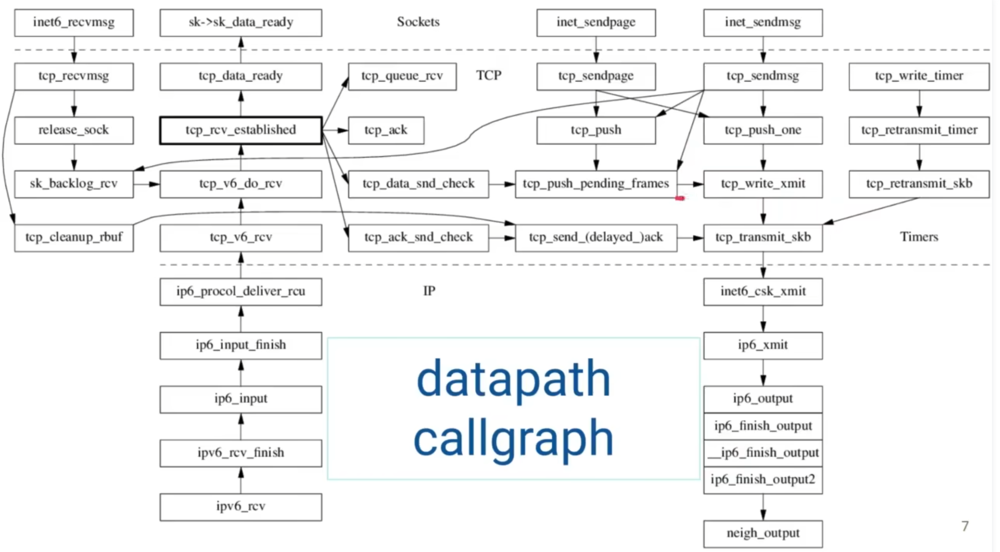

# TCP

## Brief

TCP is a/the reliable byte stream protocol for internet

How to be reliable and sequence-preserving?

* Assign every byte in the stream a sequence number
* Cumulative positive acknowledge(I've receied all bytes up to seqno.X)
* Retransmit when didn't get ACK in time

TCP is connection-oriented

TCP state transition diagram : pic here
All about is

* Establish a connection
* Tear down a connection

Most fo CPU cycles spent in **ESTABLISHed** state, for transferrring bytes.

Too many articles talk about three-way handshake(3WH) and 4-times close.

## State Machine

## TCP本质

带重传的累积正向应答

1. Cumulative positive acknowledgement with retransmission
2. Flow control(sliding window)
3. Congestion control

## TCP is bidirectional

TCP endpoint has both sender and receiver

Is TCP Full-Duplex? From API yes, from impl, mayby.

## TCP/IP Implementation

* BSD     iOS/macOS
* Linux   Android / Chrome OS
* Windows PC / Laptop
* Solaris (Mentat TCP)

User space gvisor, mtcp, seastar
Iot (lwip) RFC 9006 Single-MSS

## TCP/TP drawbacks

not providing enough address bits
y2k, y2038, 4Gib max size on some file systems, MAX_PATH

## Hard limits

16-bit port number: limits the concurrency of a client(e.g.web crawler). wordaround

32-bit sequence number: wraps within 1 second on 40GbE.
  Timestamp options, uses 12 bytes in options

16-bit window size: limits in-flight bytes and throughput Window scale option, max 1GB window, ws=7 or 8 is common nowadays.

4-bit header length: 60-bytes max, minus 20 bytes, allowing for up to 40 bytes of options in header. Minus 12 bytes for TSopt, only 28 bytes for options like SACKs.